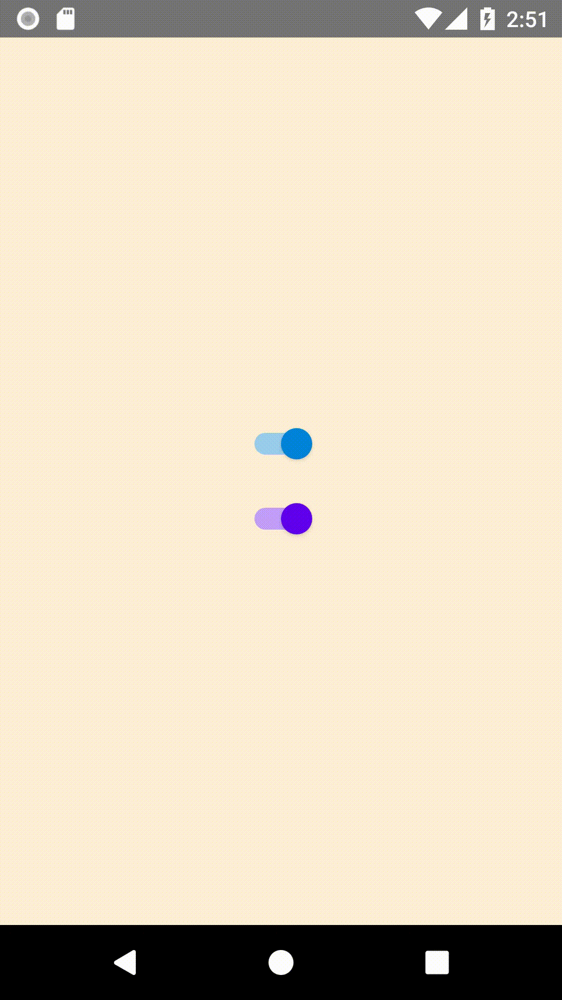

# react-native-better-switch
[](https://www.npmjs.com/package/react-native-better-switch)

Implementation of the [Material Design Switch Component][md].

- TypeScript support
- Pure JS
- Requires react-native >= 0.59

### Example



### Installation
```
yarn add react-native-better-switch
```
or
```
npm install --save react-native-better-switch
```

[md]: https://material.io/design/components/selection-controls.html#switches

### Usage

```jsx
import React, { useCallback, useState } from 'react'
import { StyleSheet, TouchableOpacity, View } from 'react-native'
import Switch from 'react-native-better-switch'

export default function App() {
  const [value, setValue] = useState(false)

  return (
    <View style={styles.container}>
      <TouchableOpacity
        activeOpacity={1}
        onPress={() => setValue(!value)}>

        <Switch value={value} />
      </TouchableOpacity>
    </View>
  )
}


const styles = StyleSheet.create({
  container: {
    flex: 1,
    justifyContent: 'center',
    alignItems: 'center',
    backgroundColor: 'white',
  },
})
```

### Documentation
The `Switch` component receives the following props:

| name               | type    | required/default               |
|--------------------|---------|--------------------------------|
| value              | boolean | required                       |
| duration           | number  | optional, defaults to 200 (ms) |
| activeThumbColor   | string  | optional, defaults to #0084D9  |
| activeTrackColor   | string  | optional, defaults to #9ACDED  |
| inactiveThumbColor | string  | optional, defaults to #FFFFFF  |
| inactiveTrackColor | string  | optional, defaults to #C6C6C6  |
